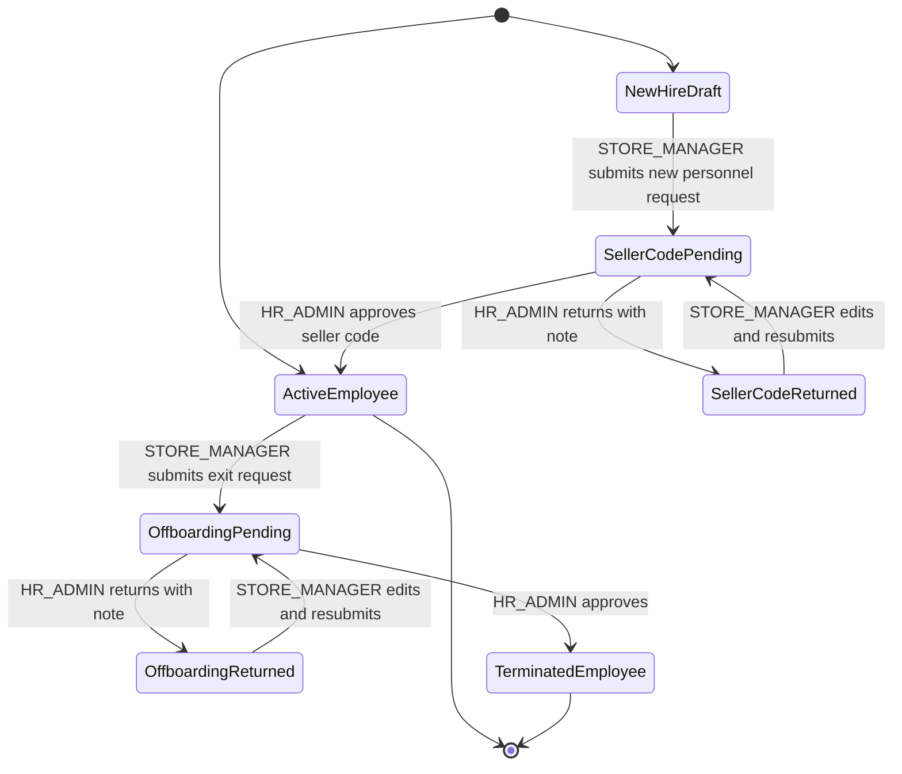

# Personnel Management V1

## Purpose

Personnel Management V1 records the first controlled personnel lifecycle surface in the project.

It covers two store-originated, HR-approved workflows:

- seller code / new personnel activation request
- employee offboarding / termination request

The goal is not to build a full HRIS. The goal is to keep store personnel master data controlled, auditable, and connected to the existing store action-scope model.

## CODEX DURUST YORUM

This feature belongs in the product now because personnel identity is becoming a real dependency for KPI import, target distribution, store staffing, turnover, and future norm kadro work.

The right module boundary is `store-ops/workforce`, not a new standalone HR system. Store managers know store-level personnel events, but HR/Admin must remain the final control point for official seller code activation and offboarding.

This does not create a second source of truth if we keep one rule: store users submit requests, HR/Admin approves mutations, and the approved mutation updates `ops.employee` and `ops.employee_assignment_history`. Request rows are evidence and workflow history, not the live personnel record.

V1 should stay narrow. It should not include payroll, document upload, bulk operations, transfer workflow, rejection reason taxonomy, legal termination packages, or external HR integration yet. Those are future product depth.

Recommendation: continue with this controlled V1. It is a healthy foundation and not decorative work.

## V1 Scope

### Seller Code Request

Store manager submits:

- first name
- last name
- position
- national ID
- phone number
- hire date
- optional request reason

System behavior:

- Store manager cannot enter the official seller code.
- TC/national ID is stored as hash plus last four digits.
- HR/Admin sees the request in the admin inbox.
- HR/Admin enters the approved seller code.
- Approval creates `ops.employee`.
- Approval creates active `ops.employee_assignment_history`.
- Audit events are emitted:
  - `seller_code_request.created`
  - `seller_code_request.approved`
  - `seller_code_request.rejected`
  - `seller_code_request.resubmitted`

### Offboarding Request

Store manager submits:

- active employee
- termination date
- termination reason
- request reason

System behavior:

- Store manager cannot directly terminate the employee.
- HR/Admin sees the request in the admin inbox.
- Approval updates `ops.employee.employment_status` to `terminated`.
- Approval writes `ops.employee.termination_date`.
- Approval closes the active assignment with `end_date` and `assignment_status = inactive`.
- Approval creates `ops.turnover_event`.
- Audit events are emitted:
  - `employee_offboarding_request.created`
  - `employee_offboarding_request.approved`
  - `employee_offboarding_request.rejected`
  - `employee_offboarding_request.resubmitted`

### Return And Resubmit

HR/Admin can return a pending seller-code or offboarding request with a required review note.

Store manager can see the returned request on `/store/approvals`, load it into the original form, correct the fields, and resubmit the same request id.

Rules:

- Return changes only the request row status to `rejected`.
- Return does not mutate `ops.employee`, `ops.employee_assignment_history`, or `ops.turnover_event`.
- Resubmit changes the same request row back to `pending_hr_approval`.
- Resubmit clears the latest row-level review marker because the row is pending again.
- Resubmit emits audit evidence so the previous HR note remains traceable.
- Seller-code resubmit requires re-entering the full TC/national ID because the full value is not stored.

## State Map



## Role And Scope Rules

- `STORE_MANAGER` can create requests only for stores in `actionScope.assignedStoreIds`.
- `STORE_MANAGER` can resubmit returned requests only when the request store is still in `actionScope.assignedStoreIds`.
- `SUPER_ADMIN` can create requests in the same store action flow when scoped.
- `HR_ADMIN` and `SUPER_ADMIN` can approve or return requests from the admin inbox.
- Store users do not directly mutate official employee status or official seller code.
- Read/action scope separation remains intact:
  - request creation uses action scope
  - admin review uses HR/Admin role and scoped request listing

## Data Ownership

Operational source of truth:

- `ops.employee`
- `ops.employee_assignment_history`
- `ops.turnover_event`

Workflow evidence:

- `ops.seller_code_request`
- `ops.employee_offboarding_request`

Audit:

- `audit.event_log`
- cataloged audit events in `AUDIT_EVENT_CATALOG`

## API Surface

Seller code:

- `GET /api/workforce/seller-code-reference`
- `GET /api/workforce/seller-code-requests`
- `POST /api/workforce/seller-code-requests`
- `PATCH /api/workforce/seller-code-requests/:requestId/approve`
- `PATCH /api/workforce/seller-code-requests/:requestId/reject`
- `PATCH /api/workforce/seller-code-requests/:requestId/resubmit`
- `GET /api/workforce/position-options`

Offboarding:

- `GET /api/workforce/store-employees`
- `GET /api/workforce/offboarding-requests`
- `POST /api/workforce/offboarding-requests`
- `PATCH /api/workforce/offboarding-requests/:requestId/approve`
- `PATCH /api/workforce/offboarding-requests/:requestId/reject`
- `PATCH /api/workforce/offboarding-requests/:requestId/resubmit`

Frontend:

- `/store/approvals`
- `/admin/inbox`

## Current Limitations

- Transfer between stores is not implemented yet.
- Bulk personnel operations are not implemented yet.
- External HR/source-system sync is not implemented yet.
- Phone number is stored on the seller code request evidence row only.
- Full national ID is not returned to the frontend after submission.

These are deliberate V1 boundaries, not hidden defects.

## Verification Evidence

Latest verified gate:

```powershell
npm.cmd run check:release
```

Observed result:

- root script tests passed
- backend lint passed
- root script tests passed: 28 tests
- backend lint passed
- backend tests passed: 43 suites / 306 tests
- backend build passed
- backend production audit found 0 vulnerabilities
- frontend lint passed
- frontend script tests passed: 7 tests
- frontend build passed
- frontend Playwright tests passed: 33 tests
- frontend production audit found 0 vulnerabilities
- backend build passed
- backend production audit found 0 vulnerabilities
- frontend lint passed
- frontend script tests passed
- frontend build passed
- frontend Playwright tests passed: 31 tests
- frontend production audit found 0 vulnerabilities

Targeted behavior covered:

- active store employees can be listed for assigned store action scope
- store manager can submit offboarding request
- HR/Admin approval terminates employee and closes assignment
- turnover event is created on offboarding approval
- store manager can submit seller code request without entering official code
- HR/Admin approval creates employee and assignment with manually entered seller code
- admin inbox renders seller code and offboarding approval queues
- HR/Admin can return seller-code and offboarding requests with a required note
- returned requests can be loaded on `/store/approvals`, edited, and resubmitted with the same request id
- rejected and resubmitted audit events are cataloged

## Next Logical Step

Controlled existing personnel/store master-data bootstrap planning is now recorded in:

- `docs/plans/personnel-master-data-bootstrap-v1.md`

The next implementation step should inspect the actual baseline file shape, then start V1 store baseline staging and validation before personnel baseline promotion.
