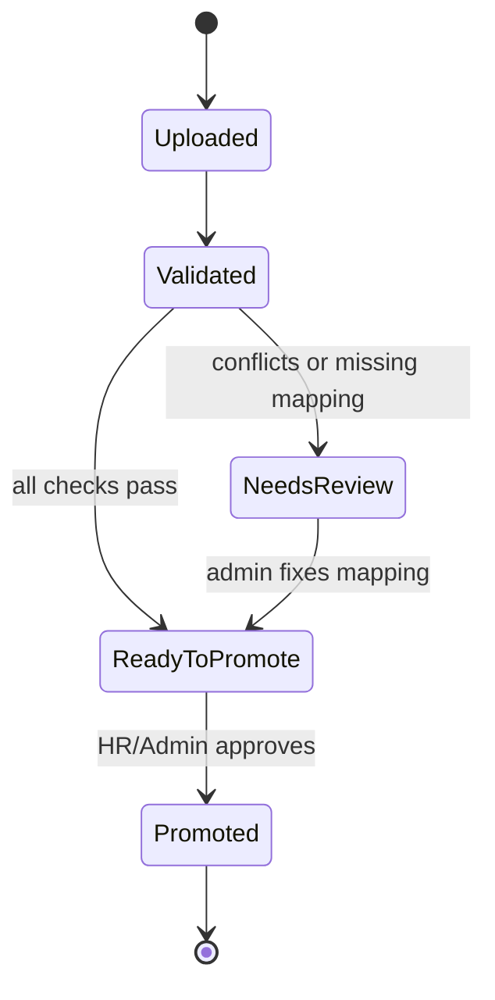

# Personnel Master Data Bootstrap V1

## Purpose

This note records the controlled first-load plan for existing stores, employees, and seller codes.

This is not the daily KPI import. This is the baseline master-data step that tells the platform which stores and employees officially exist before KPI rows, rankings, offboarding, seller-code requests, and future norm kadro work depend on them.

## CODEX DURUST YORUM

This belongs in the product now. The project has reached the point where KPI import and personnel workflows need clean official identity data.

The dangerous version of this feature would be a direct Excel-to-`ops.employee` write. That would be fast, but it would make dirty initial data look official and later pollute KPI, score, ranking, turnover, and request workflows.

The right version is a controlled bootstrap:

- store master first
- personnel master second
- staging/review before live promotion
- no automatic temporary store or employee creation
- audit and lineage for every promoted row

Recommendation: proceed with this plan, but implement it in stages. Start with store baseline, then personnel baseline. Do not blend this with daily sales Excel import.

## Intake Gate Answers

### 1. Who is this for?

Primary operator:

- `HR_ADMIN` / admin user preparing initial official personnel data

Affected users:

- `STORE_MANAGER` sees only official active personnel after promotion
- `STORE_PERSONNEL` can later be connected to their official identity
- reporting/import jobs depend on official store and employee identity

This is an admin-controlled data action, not a store-manager request flow.

### 2. What problem are we solving?

The user already has current store personnel lists and seller codes. The system needs those rows as official baseline data so later workflows do not start from an empty or guessed personnel table.

After this exists:

- only stores we care about are marked import-active
- Garaj/cadir/irrelevant stores stay outside KPI scope
- existing employees and seller codes are loaded once as baseline
- future changes use request workflows instead of silent table edits

Out of scope:

- payroll
- document upload
- external HR sync
- automatic transfer inference
- daily KPI sales import
- direct manager-entered official seller code

### 3. What permission and scope boundary applies?

V1 should be admin-only.

- `HR_ADMIN` and `SUPER_ADMIN` can upload/review/promote bootstrap batches.
- Store managers do not promote bootstrap rows.
- Store managers continue to use seller-code/offboarding requests after baseline.
- Read/action scope remains unchanged for normal store workflows.

Unauthorized users should receive `403`. Authenticated users without bootstrap permission should not see staged rows.

### 4. What data does it touch?

Operational source of truth:

- `ops.store`
- `ops.employee`
- `ops.employee_assignment_history`
- `ops.position`

Existing helpful fields:

- `ops.store.store_type` already supports `company`, `franchise`, `operator`
- `ops.store.kpi_import_enabled` controls whether the store participates in KPI import
- `ops.employee.external_employee_ref` is the official seller code identity
- `ops.employee_assignment_history` owns active store/position assignment

Staging/evidence should be additive:

- use a bootstrap batch record
- keep raw row evidence
- keep validation status
- promote only valid/approved rows

### 5. What existing flows does it connect to?

Connects to:

- KPI import matching
- employee KPI snapshots
- store active employee lists
- seller-code request latest FM reference logic
- offboarding request employee lookup
- future norm kadro comparison
- audit trail

Does not replace:

- seller-code request workflow
- offboarding request workflow
- daily KPI import
- source-specific JSON connector

### 6. How do we know it is correct?

Success path:

- known stores are promoted to `ops.store`
- store types map correctly:
  - `Sirket` -> `company`
  - `Franchise` -> `franchise`
  - `Isletme` -> `operator`
- only selected stores get `kpi_import_enabled = true`
- known personnel are promoted to `ops.employee`
- seller code is unique through `external_employee_ref`
- active assignment is created in `ops.employee_assignment_history`

Failure/conflict states:

- duplicate seller code
- unknown store code
- unmapped position
- multiple active assignments for the same seller code
- missing required name/seller code/store
- store outside active KPI scope

Verification later must include:

- backend repository/service unit tests
- integration tests for promote/idempotency/conflict rows
- admin API tests for permission boundaries
- frontend/admin smoke if a UI is added
- root `npm.cmd run check:release`

## V1/V2/V3 Shape

### V1: Store Baseline

Goal: define which stores the platform owns and which ones should participate in KPI import.

Input fields:

- store code
- store name
- region
- store type: `Sirket`, `Franchise`, `Isletme`
- status: active/inactive/closed
- KPI import enabled: yes/no

Rules:

- do not import sales/KPI data for stores with `kpi_import_enabled = false`
- do not create temporary stores from KPI files
- unmapped stores go to review, not live score tables

### V2: Personnel Baseline

Goal: load existing active employees and official seller codes.

Input fields:

- store code
- seller code
- first name
- last name
- position
- employment status
- hire date if available
- optional phone/national ID only if available and legally appropriate

Rules:

- seller code maps to `ops.employee.external_employee_ref`
- one active primary assignment per employee at baseline
- position must map to `ops.position`
- missing TC should not block baseline if seller code is present
- if TC is provided, keep the existing hash/last4 safety model

### V3: Ongoing Maintenance

Goal: after baseline, detect and control changes instead of silently mutating official data.

Possible later features:

- diff latest personnel list against current system
- suggest new hire/offboarding/transfer candidates
- route suggested changes into approval workflows
- show store manager correction queue
- support bulk HR review

V3 should not be built until V1/V2 are stable.

## Staging And Promotion Rules

Bootstrap rows should pass through this lifecycle:



Promotion rules:

- promotion is idempotent for the same batch/row hash
- promoted rows keep source batch and row evidence
- duplicate seller code blocks promotion
- store update and personnel update should be separate review actions
- no score/snapshot should be written from bootstrap directly

## KPI Import Interaction

This plan strengthens KPI import without changing KPI math.

Rules:

- daily sales/KPI imports should resolve stores only from official `ops.store`
- personnel KPI imports should resolve seller/personnel only from official `ops.employee.external_employee_ref`
- rows for unknown stores become `unmapped_store`
- rows for unknown seller codes become `unmapped_employee`
- unmapped rows remain evidence and review material, not scored data

This keeps the earlier Excel KPI decision intact:

- personnel performance uses positive gross personnel sales
- store performance uses net store sales
- returns/refunds do not subtract from personnel score
- store net ciro remains the official store target realization value

## Implementation Order

Recommended order when coding starts:

1. Store bootstrap DB/staging contract.
2. Store bootstrap validation and promote service.
3. Store bootstrap admin API.
4. Personnel bootstrap DB/staging contract.
5. Personnel bootstrap validation and promote service.
6. Personnel bootstrap admin API.
7. Optional admin UI for upload/review/promote.
8. KPI import resolver guard that fails unknown store/personnel rows into review categories.

## Acceptance Cases

- A Garaj/cadir store in an uploaded KPI file is not scored if it is not defined as active/import-enabled in `ops.store`.
- A known active store is accepted for KPI import.
- A store with `Sirket` maps to `company`.
- A store with `Franchise` maps to `franchise`.
- A store with `Isletme` maps to `operator`.
- A known seller code creates or updates one official employee identity.
- A duplicate seller code blocks the row and shows a conflict.
- A known employee gets exactly one active primary assignment at baseline.
- Re-uploading the same accepted baseline does not double-create employees or assignments.
- Store managers cannot run bootstrap promotion.

## Current Decision

Proceed with V1 store baseline first, then V2 personnel baseline.

Do not implement direct Excel-to-live-table mutation.

Do not expand this into a full HRIS.

## File Inspection Note: Mart KPI Excel Files

Inspected on 27 April 2026:

- `C:\Users\suley\Downloads\MAĞAZA TABLO.xlsx`
- `C:\Users\suley\Downloads\PERSONEL TABLO.xlsx`

These files are KPI snapshot inputs, not sufficient master-data baseline files.

### MAĞAZA TABLO.xlsx

Sheet:

- `Export`

Columns:

- `Mağaza Adı`
- `Hedef`
- `Ciro`
- `Gerçekleşen %`
- `Satış Adedi`
- `FF`
- `CR`
- `ATV`
- `Fatura Sayısı`
- `UPT`
- `OSF`
- `Geçen Yıl Ciro`
- `Ciro Artış`

Observed shape:

- 271 data-like rows
- 270 unique store names
- 187 rows with `Ciro`
- 183 rows with `Hedef`
- includes non-store or special rows such as e-commerce/total-style rows
- includes store names containing Garaj, Cadir/Cadir-like, Pop Up, and Outlet patterns

Bootstrap impact:

- useful for store KPI snapshot import
- not enough to create official store master data because it lacks store code, region, store type, and explicit KPI import scope
- `Total`/summary rows and e-commerce rows must be excluded or separately classified before store KPI materialization

### PERSONEL TABLO.xlsx

Sheet:

- `Export`

Columns:

- `Adı`
- `Mağaza Adı`
- `P. Satış Adeti`
- `Satış Tutarı`
- `Ciro Payı`
- `Mağaza Cirosu`
- `P.ATV`
- `P.UPT`

Observed shape:

- 2940 data-like rows
- 185 unique store names
- 769 positive `Satış Tutarı` rows
- 2031 negative `Satış Tutarı` rows
- 139 zero `Satış Tutarı` rows
- the `Adı` column can include person/store-like labels, so it cannot be treated as stable employee identity
- all 185 person-file store names have exact normalized matches in the store file

Bootstrap impact:

- useful for March personnel KPI snapshot logic
- not enough to create official employee master data because it lacks seller code, position, hire date, employment status, phone, and national ID
- should not create temporary employees from names
- negative rows must stay out of employee KPI creation and must not be double-subtracted from store KPI when store table is already the net source

### Reconciliation Finding

For the 185 stores that exist in both files, store-file `Ciro` reconciles exactly with person-file net sales using:

```text
person positive sales + person negative rows = store net ciro
```

The Marmara Park acceptance case confirms the intended business rule:

- store net ciro comes from `MAĞAZA TABLO.xlsx`
- personnel gross sales comes from positive `Satış Tutarı` rows only
- person-file negative rows explain the netting difference, but do not reduce employee KPI

### Decision From Inspection

These files should feed Excel KPI Import V1, not Personnel Master Data Bootstrap V1.

Personnel/store master-data bootstrap still needs a separate baseline file or sheet with at minimum:

- store code
- store name
- region
- store type: `Sirket`, `Franchise`, `Isletme`
- KPI import enabled flag
- seller code
- employee first/last name
- position
- employment status
- assignment store
- hire date if available

## Next Logical Step

Because the inspected March Excel files are KPI snapshot files, not baseline master files, the next implementation step should focus on Excel KPI Import V1 mapping and guards.

Personnel Master Data Bootstrap V1 should wait for a true store/personnel baseline list that contains store codes and seller codes.
