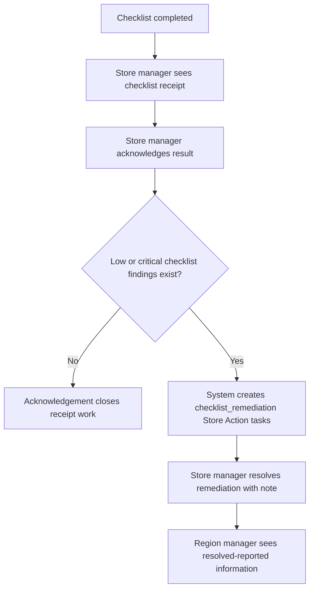

# Store Action Checklist Remediation V1

Status: decision locked, implementation pending
Shelf: Store Action

## Reader And Action

Reader:

- an engineer or future agent adding checklist-derived Store Action behavior,
  Store Tasks UI, workflow inbox mapping, notifications, or checklist
  acknowledgement behavior.

After reading, they should know how checklist acknowledgement and checklist
remediation differ, what V1 must create automatically, and what must remain
out of scope.

## Decision

Checklist acknowledgement and remediation are separate product concepts.

- `checklist_receipt` remains acknowledgement work. It means the store manager
  saw and accepted responsibility for reading the checklist result.
- Acknowledgement does not mean the low checklist item has been fixed.
- After a checklist is acknowledged, low or critical checklist findings create
  Store Action remediation work automatically.
- The remediation source family is `checklist_remediation`; do not reuse
  `checklist_receipt` as the remediation task source.
- The store manager owns the remediation task.
- V1 closure requires a resolution note.
- Photo or file evidence is parked outside V1.
- Region manager visibility is informational in V1: when the store manager
  marks the remediation as resolved, the region manager can see that the store
  reported the issue as resolved through the relevant Store Action, inbox, or
  read surface.
- Region manager approval, verification, reopen, or rejection of the resolved
  remediation is parked outside V1.

## Why

The user workflow should not ask the store manager to do the same job twice.

Checklist acknowledgement answers this question:

```text
Did the store manager see and accept the completed checklist result?
```

Store Action remediation answers this question:

```text
Was the low checklist finding handled by the store?
```

Keeping those separate prevents the Store Tasks page from becoming another
checklist acceptance screen, while still turning real low checklist findings
into operational follow-up.

## V1 Flow



## Task Formation

Default V1 formation:

- Create remediation tasks only after successful checklist acknowledgement.
- Create tasks from real checklist findings only; never from fake UI rows,
  synthetic examples, or frontend-only labels.
- Use the checklist source model/config to determine low or critical findings.
- If the source model has a checklist section, area, or category, group low
  findings by that unit to avoid noisy task flooding in 30-store regions.
- If no section, area, or category exists, one low checklist item may become one
  remediation task.
- Each generated remediation task must retain source reference to:
  - checklist instance,
  - store,
  - checklist template/version,
  - checklist item or grouped low area,
  - role/source type such as BM checklist or VM checklist when available.
- Generation must be idempotent. Re-acknowledging, retrying, or refreshing the
  same checklist result must not create duplicate active remediation tasks.

If low/critical threshold ownership or source metadata is missing, the
implementation must stop and keep the source parked rather than inventing a
threshold.

## Store Manager Behavior

The Store Tasks page should show remediation work, not another checklist
acceptance step.

V1 allowed store-manager actions:

- inspect the remediation task,
- see the checklist finding context,
- change task status according to the existing Store Action lifecycle,
- close the task with a required resolution note.

V1 must not require:

- duplicate checklist acknowledgement,
- separate "accept task" action for the same checklist finding,
- photo upload,
- region manager verification before the store can report resolution.

## Region Manager Behavior

For a region manager handling many stores, the useful view is operational
pressure and reported resolution state.

V1 region-manager visibility should support:

- open checklist remediation count by store,
- resolved-reported remediation items,
- blocked or overdue remediation items if those states exist in the Store
  Action lifecycle,
- source context back to the checklist instance or finding.

V1 region-manager behavior is read/informational for resolved checklist
remediation. Approval, rejection, reopen, and evidence verification require a
separate V2 decision.

## Informational Signal

V1 must preserve the product meaning that the region manager can see a
store-reported resolution. The delivery channel is separate: page/inbox/read
surface is in scope, while push, email, mobile, or provider-backed notification
delivery is not required for V1.

If notification copy is implemented in a visible surface, it should be
informational:

```text
{store} magazasi {area} checklist probleminin cozuldugunu belirtti.
```

The message must not claim the region manager verified the fix unless a future
verification workflow exists.

## Non-Goals

V1 does not include:

- photo/file evidence upload,
- push/email/mobile notification delivery,
- region-manager approval or verification,
- reopen/reject after reported resolution,
- checklist score recalculation,
- KPI score reinterpretation,
- target distribution or workforce-derived Store Action sources,
- generic task engine or generic rules engine,
- fake remediation data or frontend-only source rows.

## Implementation Guardrails

Before runtime code changes, the implementing PR must define and verify:

- exact low/critical source ownership,
- source reference shape for `checklist_remediation`,
- duplicate-generation prevention,
- assigned-store write scope for store-manager commands,
- region-manager read scope,
- workflow inbox mapping if remediation appears in inbox,
- audit event names for generated and resolved remediation,
- API/OpenAPI/generated client impact,
- rollback story with no data repair requirement.

Any implementation that requires DB schema, API shape, auth behavior, workflow
state, or notification behavior changes must be its own reviewable PR slice.

## Verification Expectations

The first implementation PR must include targeted coverage for:

- acknowledging a checklist with no low findings creates no remediation task,
- acknowledging a checklist with low findings creates remediation task(s),
- repeated acknowledgement or retry does not duplicate active tasks,
- generated tasks retain source reference to the checklist finding,
- store-manager command scope is assigned-store only,
- region-manager read scope does not leak other regions,
- closure requires a resolution note,
- resolved notification or read model says "reported resolved", not "verified",
- existing KPI exception Store Action behavior is unchanged.
